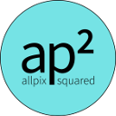

<!--
SPDX-FileCopyrightText: 2016-2025 CERN and the Allpix Squared authors
SPDX-License-Identifier: CC-BY-4.0
-->
<!-- 'tis but a scratch -->
[](https://cern.ch/allpix-squared)

# Allpix<sup>2</sup>

### Generic Pixel Detector Simulation Framework

Allpix<sup>2</sup> is a flexible and modular simulation framework for semiconductor radiation detectors, written in modern C++. The goal of the Allpix<sup>2</sup> framework is to provide a comprehensive and easy-to-use package for end-to-end simulations of the performance of patterned semiconductor radiation detectors, from incident ionizing radiation to the digitization of pixel hits in the detector ASIC.

For more details about the project please have a look at the website at [https://cern.ch/allpix-squared](https://cern.ch/allpix-squared).

[](https://gitlab.cern.ch/allpix-squared/allpix-squared/commits/master)
[](https://scan.coverity.com/projects/allpix-squared)
[](https://doi.org/10.5281/zenodo.3550935)
[](https://api.reuse.software/info/gitlab.cern.ch/allpix-squared/allpix-squared)


## Using Allpix<sup>2</sup>

### Docker Images

Docker images are provided for all releases and the latest development version of the framework.
To create a container from the latest Docker image and start an interactive shell session with the current host system path mounted to `/data`, run:

```shell
docker run --interactive --tty --volume "$(pwd)":/data --name=allpix-squared \
           gitlab-registry.cern.ch/allpix-squared/allpix-squared bash
```

Alternatively it is also possible to directly start the simulation instead of an interactive shell:

```shell
docker run --tty --rm --volume "$(pwd)":/data --name=allpix-squared \
           gitlab-registry.cern.ch/allpix-squared/allpix-squared "allpix -c my_simulation.conf"
```

To run a tagged version, append the tag to the image name, e.g. `gitlab-registry.cern.ch/allpix-squared/allpix-squared:v2.2.1`.
More detailed information on the Docker images can be found in the user manual.


### Machines with CVMFS

Machines with a supported OS and the [CERN Virtual Machine File System (CVMFS)](https://cernvm.cern.ch/portal/filesystem) can load Allpix<sup>2</sup> and its dependencies from there by sourcing the respective environment:

```shell
source /cvmfs/clicdp.cern.ch/software/allpix-squared/<version>/x86_64-<system>-<compiler>-opt/setup.sh
```

where `<version>` should be replaced with the desired Allpix<sup>2</sup> version, e.g. `2.2.1` and `<system>` with the operating system of the executing machine (`centos7`, `centos8` or `mac11`). The compiler versions available via the `<compiler>` tag depend on the selected operating system.

When running for the first time, the CVMFS cache of the executing machine has to be populated with all dependencies.
This can lead to a significant start-up time for the first execution, it does not affect simulation performance or subsequent executions with the cache already present.


### Compilation from Source

Allpix<sup>2</sup> uses the CMake build system, version 3.6.3 or later, to configure and compile the framework.
It requires a compiler with full C++17 support.
More detailed instructions on how to compile the framework from source can be found in the user manual.
The framework has the following external dependencies:

* [ROOT](https://root.cern.ch/building-root) (required, with the GenVector component)
* [Boost.Random](https://www.boost.org/doc/libs/1_75_0/doc/html/boost_random/reference.html) (required, version >= 1.64.0)
* [Geant4](http://geant4-userdoc.web.cern.ch/geant4-userdoc/UsersGuides/InstallationGuide/html/installguide.html) (optional, but required for typical purposes, multithreading capabilities should be enabled)
* [Eigen3](http://eigen.tuxfamily.org/index.php?title=Main_Page) (optional, but required for typical purposes)

For machines with CVMFS, e.g. the CERN LXPLUS or DESY NAF clusters, all dependencies and required compiler versions can be satisfied via:

```shell
source etc/scripts/setup_lxplus.sh
```

Compilation TL;DR:

```shell
mkdir build && cd build/
cmake ..
make install
```


## Documentation

The User Manual of the most recent release version of Allpix<sup>2</sup> is available [from the website](https://cern.ch/allpix-squared/usermanual/allpix-manual.pdf).\
The respective Doxygen reference is [published online](https://allpix-squared.docs.cern.ch/reference/) as well.


## Citing Allpix<sup>2</sup>

Allpix<sup>2</sup> is distributed freely and openly under the MIT license, but the authors kindly ask to cite the reference paper and the Zenodo record in scientific publications:

* The reference paper of Allpix<sup>2</sup> has been published in *Nuclear Instrumentations and Methods in Physics Research A* with open access and can be obtained from [https://doi.org/10.1016/j.nima.2018.06.020](https://doi.org/10.1016/j.nima.2018.06.020).
    A preprint version is available on [arxiv:1806.05813](https://arxiv.org/abs/1806.05813).
    Please cite this paper when publishing your work using Allpix<sup>2</sup> as:

    > S. Spannagel et al., “Allpix<sup>2</sup>: A modular simulation framework for silicon detectors”, Nucl. Instr.
    > Meth. A 901 (2018) 164 – 172, doi:10.1016/j.nima.2018.06.020, arXiv:1806.05813

* The versioned Zenodo record can be found at [https://doi.org/10.5281/zenodo.3550935](https://doi.org/10.5281/zenodo.3550935). Please cite the version used for the published work. For example, the latest version should be cited as:

    > S. Spannagel, K. Wolters & P. Schütze. (2022). Allpix Squared - Generic Pixel Detector Simulation Framework (2.2.0).
    > Zenodo. [https://doi.org/10.5281/zenodo.6387859](https://doi.org/10.5281/zenodo.6387859)

Further papers with algorithm validations as well as tutorials and seminar talks can be found [on the website](https://cern.ch/allpix-squared/page/publications/).


## Developing Allpix<sup>2</sup>

See [AUTHORS.md](./AUTHORS.md)

## Contributing to Allpix<sup>2</sup>

All types of contributions, being it minor and major, are welcome. Please refer to our [contribution guidelines](CONTRIBUTING.md) for a description on how to get started.
Before adding changes it is highly recommended to carefully read through the documentation in the User Manual first.


## Licenses

This software is distributed under the terms of the MIT license. The documentation is distributed under the terms of the CC-BY-4.0 license.

This repository follows the [REUSE](https://reuse.software/) specification, a full copyright report can be created via `reuse spdx`.

A copy of all licenses can be found in the [LICENSES](LICENSES/) folder.

The following third-party codes are included in the repository:

* The LaTeX, Pandoc and CodeCoverage CMake modules, BSD 3-Clause License.
* The octree library by Jens Behley, MIT license, [original source code](https://github.com/jbehley/octree).
* The cereal C++11 serialization library, BSD 3-Clause License, [original source code](https://github.com/USCiLab/cereal).
* The combination algorithms by Howard Hinnant, Boost Software License Version 1.0, [original source code](https://github.com/HowardHinnant/combinations) and [class documentation](https://howardhinnant.github.io/combinations/combinations.html).
* The CTest to JUnit XSL template, MIT License, [original source code](https://github.com/rpavlik/jenkins-ctest-plugin).
* The Magic Enum library by Daniil Goncharov, MIT license, [original source code](https://github.com/Neargye/magic_enum).
