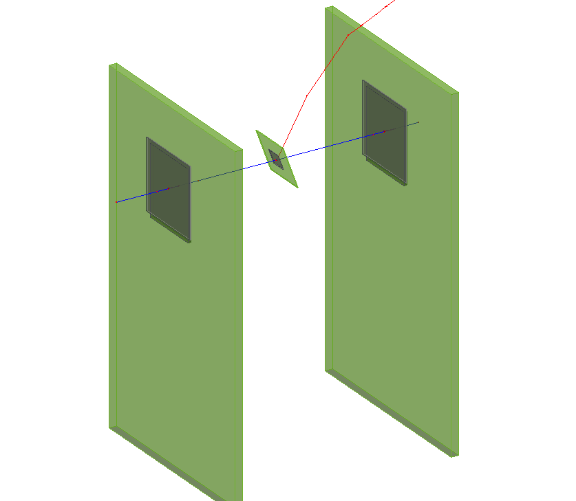

The detector configuration consists of a set of sections describing the
detectors in the setup. Each section starts with a header describing the
name used to identify the detector; all names are required to be unique.
Every detector has to contain all of the following parameters:

  - A string referring to the `type` of the detector model. The model
    should exist in the search path.

  - The 3-dimensional `position` in the world frame in the order x, y, z.

  - The `orientation` specified as X-Y-Z extrinsic Euler angles. This means
    the detector is rotated first around the world's X-axis, then around the
    world's Y-axis and then around the world's Z-axis. Alternatively the
    orientation can be set as Z-Y-X or Z-X-Z extrinsic Euler angles.

In addition to these required parameters, the following parameters allow
to randomly misalign the respective detector from its initial position.
The values are interpreted as width of a normal distribution centered
around zero. In order to reproduce misalignments, a fixed random seed
for the framework core can be used. Misalignment can be introduced both
for shifts along the three global axes and the three rotations angles
with the following parameters:

  - The parameter `alignment_precision_position` allows the specification of
    the alignment precision along the three global axes. Each value represents
    the Gaussian width with which the detector will be randomly misaligned
    along the corresponding axis.

  - The parameter `alignment_precision_orientation` allows to specify the
    alignment precision in the three rotation angles defined by the parameter.
    The misalignments are added to the individual angles before combining them
    into the final rotation as defined by the parameter.

The optional parameter `role` accepts the values `active` for detectors and
`passive` for passive elements in the setup. If no value is given, `active`
is taken as the default value.

Furthermore it is possible to specify certain parameters of the detector
explained in more detail later. This allows to quickly adapt e.g. the
sensor thickness of a certain detector without altering the actual
detector model file.

\
*Visualization of a Pion passing through the telescope setup defined in
the detector configuration file. A secondary particle is produced in the
material of the detector in the center.*

An example configuration file describing a setup with one CLICpix2
detector and two Timepix \[[@timepix]\] models is the following:

```ini
# Placement of first detector, named "telescope1"
[telescope1]
# Type to the detector is the "timepix" model
type = "timepix"
# Position the detector at the origin of the world frame
position = 0 0 0mm
# Default orientation: perpendicular to the incoming beam
orientation = 0 0 0

# Placement of the second detector, the "DUT (device under test)
[dut]
# Detector model is "clicpix2"
type = "clicpix2"
# Position is downstream of "telescope1":
position = 100um 100um 25mm
# Rotated by 20 degrees around the world x-axis
orientation = 20deg 0 0

# Third detector is downstream "telescope2"
[telescope2]
# Detector type again is "timepix"
type = "timepix"
# Placement 50 mm downstream of the first detector
position = 0 0 50mm
# Default orientation
orientation = 0 0 0
```

This configuration is used in the rest of this chapter for explaining
concepts.

## Passive material configuration

Descriptions of passive materials can be added to the detector setup via
a set of sections, with a syntax similar to the detector configuration.
Passive geometry entries are identified by the parameter set to . Each
section starts with a header describing the name used to identify the
passive material; all names are required to be unique.

Every passive material has to contain all of the following parameters:

  - The `position` and `orientation` of the material as described for
    the detector.

  - A string referring to the `type` of the passive material. The model
    should be interpreted by the module constructing the passive material,
    such as for example the `GeometryBuilderGeant4` module.

  - A string referring to the `material` of the passive material. The
    materials are defined in the `GeometryBuilderGeant4` module and are
    described in the module section.

  - A set of size parameters specific for the model that is chosen. All
    size parameters that describe the total length of something are
    placed such that half of this total length extends from each side of
    the given `position`. If a parameter describes the radius, this means
    the radius will extend from the `position` on both sides, making its
    total size two times the radius in the given direction.

In addition, an optional string referring to the `mother_volume`, which
defines another passive material the volume will be placed in, can be
specified.

{}
If a mother volume is chosen, the position defined in the
configuration file will be relative to the center of the mother volume.
An error will be given if the specified mother volume is too small for the
specified size or position of this volume. Per default, the mother volume
is the world frame.
{}

{}
If the `mother_volume` is a hollow material, only the non-hollow part
of the material is considered part of the material. Placing a passive volume
in the hollow part requires a different `mother_volume`.
{}

Similar to the detector configuration, the parameters `orientation_mode`,
`alignment_precision_position` and `alignment_precision_orientation` can be
used optionally to define the rotation order and a possible misalignment of
passive materials.

An example configuration file describing a set of passive materials with
different configuration options is the following:

```ini
# Placement of a box made of lead
[box1]
type = "box"
size = 100mm 100mm 100mm
position = 200mm 200mm 0mm
orientation = 0 0deg 0deg
material = "lead"
role = "passive"

# Placement of a box made of lead
[box2]
type = "box"
size = 100mm 100mm 100mm
position = 0mm 200mm 0mm
orientation = 0 0deg 0deg
material = "lead"
role = "passive"

# Placement of a box made of lead, with a hollow opening
[box3]
type = "box"
size = 100mm 100mm 100mm
inner_size = 80mm 80mm 100mm
position = -200mm 200mm 0mm
orientation = 0 0deg 0deg
material = "lead"
role = "passive"

# Placement of a box made of aluminum, inside box1
[box4]
type = "box"
size = 50mm 50mm 50mm
position = 0mm 0mm -0mm
orientation = 0 0deg 0deg
material = "aluminum"
mother_volume = box1
role = "passive"

# Placement of a box made of the world material, inside box2
[box5]
type = "box"
size = 50mm 50mm 50mm
position = 0mm 0mm -0mm
orientation = 0 0deg 0deg
material = "world_material"
mother_volume = box2
role = "passive"

# Placement of a cylinder made of lead, with a hollow opening
[cylinder1]
type = "cylinder"
outer_radius = 50mm
inner_radius = 40mm
length = 100mm
position = 200mm 0mm 0mm
orientation = 0 0deg 0deg
material = "lead"
role = "passive"

# Placement of a cylinder made of lead
[cylinder2]
type = "cylinder"
outer_radius = 50mm
length = 100mm
position = 0mm 0mm 0mm
orientation = 0 0deg 0deg
material = "lead"
role = "passive"

# Placement of a cylinder made of lead, with a hollow opening, starting the building at an angle of 60deg and continue for 270deg
[cylinder3]
type = "cylinder"
outer_radius = 50mm
inner_radius = 20mm
length = 100mm
starting_angle = 60deg
arc_length = 270deg
position = -200mm 0mm 0mm
orientation = 0 0deg 0deg
material = "lead"
role = "passive"

# Placement of a cylinder made of the world material, inside cylinder2
[cylinder4]
type = "cylinder"
outer_radius = 25mm
length = 50mm
position = 0mm 0mm 0mm
orientation = 0 0deg 0deg
material = "world_material"
mother_volume = cylinder2
role = "passive"

# Placement of a sphere made of lead
[sphere1]
type = "sphere"
outer_radius = 50mm
position = 200mm -200mm 0mm
orientation = 0 0deg 0deg
material = "lead"
role = "passive"

# Placement of a sphere made of lead,  with a hollow opening, starting the building at a phi angle of 90deg and continue for 180deg.
[sphere2]
type = "sphere"
outer_radius = 50mm
inner_radius = 30mm
starting_angle_phi = 90deg
arc_length_phi = 180deg
position = 0mm -200mm 0mm
orientation = 0 0deg 0deg
material = "lead"
role = "passive"

# Placement of a sphere made of lead, starting the building at a theta angle of 0deg and continue for 45deg.
[sphere3]
type = "sphere"
outer_radius = 50mm
arc_length_theta = 45deg
position = -200mm -200mm 0mm
orientation = 0 -90deg 0deg
material = "lead"
role = "passive"
```

\
*Visualization of the setup described in the geometry file.*


[@timepix]: https://doi.org/10.1016/j.nima.2007.08.079
