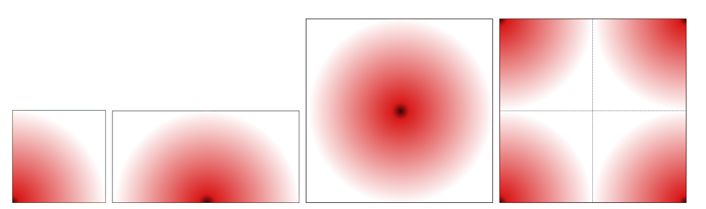
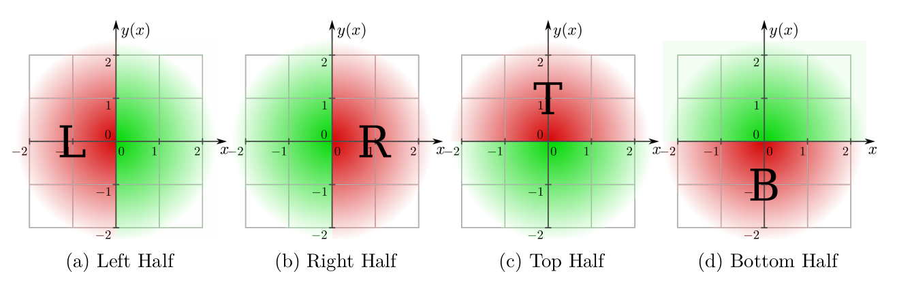
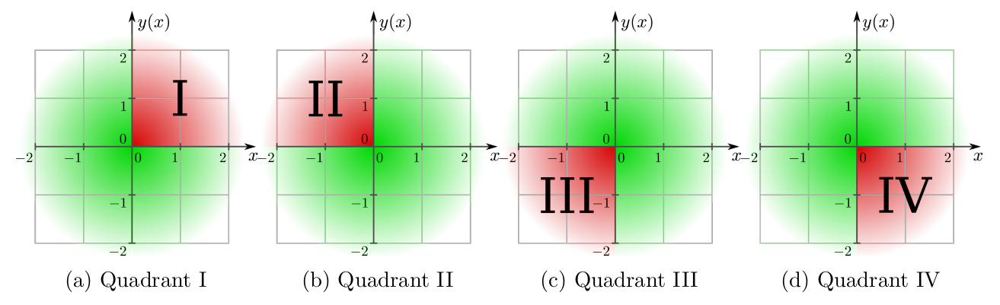
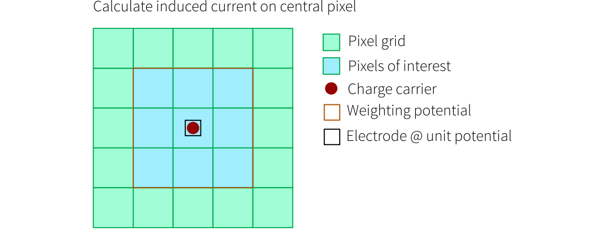
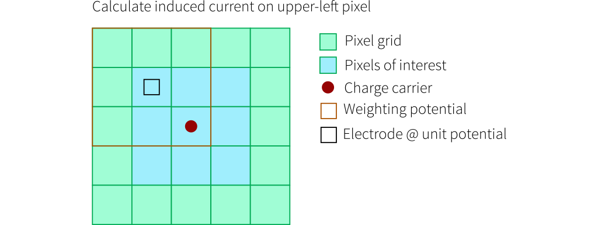
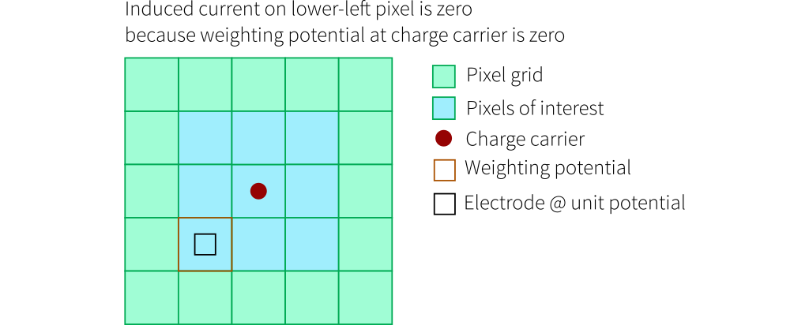

Allpix Squared allows to load externally generated field maps for various quantities such as the electric field or the doping
profile of the sensor. These maps have to be provided as regularly spaced meshes in one of the supported field file formats.
A conversion and interpolation tool to translate adaptive-mesh fields from TCAD applications to the format required by Allpix
Squared is provided together with the framework and is described in [Section 14.2](../14_additional/mesh_converter.md).

This section of the manual provides an overview of the different field types and possibilities of mapping field of single 
pixels or fractions thereof to full sensor simulations in Allpix Squared.

## Mapping of Fields to the Sensor Plane

\
*Examples for pixel geometries in field maps. The dark spot represents the pixel center, the red extent the electric field.
Pixel boundaries are indicated with a dotted line where applicable.*

Fields are always expected to be provided as rectangular maps, irrespective of the actual pixel shape.
Maps are loaded once and assigned on a per-pixel basis.
Depending on the symmetries of the pixel unit cell and the pixel grid, different geometries are supported as indicated in the
figure above. The field for a quarter of the pixel plane, for half planes (see figures below) as well as for full planes
(see figure above). The size of the field is not limited to a single pixel cell, however, for some quantities such as the
electric field only the volume within the pixel cell is used and periodic boundary conditions are assumed and expected.
Larger fields are for example useful for the weighting potential, where also potential differences to neighboring pixels
are of interest.

A special case is the field presented in the right panel of the figure above. Here, the field is not centered at the pixel
unit cell center, but at the corner of four adjacent rectangular pixels.

Not all mapping geometries might be available for all types of fields used in Allpix Squared as will be detailed below.

\
*Location and orientation of the field map with respect to the pixel center when providing a half of the pixel plane. Here,
$`(0,0)`$ denotes the pixel center, the red field portion is read from the field map and the green ones are replicated
through mirroring.*

\
*Location and orientation of the field map with respect to the pixel center when providing one quadrant in the pixel plane.
Here, $`(0,0)`$ denotes the pixel center, the red field portion is read from the field map and the green ones are replicated
through mirroring.*


The parameter `field_mapping` of the respective module defines how the map read from the mesh file should be interpreted and
applied to the sensor, and the following possibilities are available:

- `SENSOR`:
  The map is read from the file and applied periodically to the full sensor, starting with the lower-left corner of the first
  pixel, i.e. at index 0,0. The field is then flipped at its edges to the right and upwards and the procedure is repeated
  until the other sensor edge is reached. This mode allows to apply fields that span several pixel to e.g. simulate even-odd
  differences in double columns, but only works well for regular, Cartesian pixel grids.

- `PIXEL_FULL`:
  The map is interpreted as field spanning the full Euclidean angle and aligned on the center of the pixel unit cell. No
  transformation is performed, but field values are obtained from the map with respect to the pixel center.

- `PIXEL_FULL_INVERSE`:
  The map is interpreted as full field, but with inverse alignment on the pixel corners as shown above. Consequently, the
  field value lookup from the four quadrants take into account their offset.

- `PIXEL_HALF_LEFT`:
  The map represents the left Euclidean half-plane, aligned at the $`y`$ axis through the center of the pixel unit cell.
  Field values in the other half-plane are obtained by mirroring at the $`y`$ axis as indicated in the figure above.

- `PIXEL_HALF_RIGHT`:
  The map represents the right Euclidean half-plane, aligned at the $`y`$ axis through the center of the pixel unit cell.
  Field values in the other half-plane are obtained by mirroring at the $`y`$ axis as indicated in the figure above.

- `PIXEL_HALF_TOP`:
  The map represents the top Euclidean half-plane, aligned at the $`x`$ axis through the center of the pixel unit cell. Field
  values in the other half-plane are obtained by mirroring at the $`x`$ axis as indicated in the figure above.

- `PIXEL_HALF_BOTTOM`:
  The map represents the bottom Euclidean half-plane, aligned at the $`x`$ axis through the center of the pixel unit cell.
  Field values in the other half-plane are obtained by mirroring at the $`x`$ axis as indicated in the figure above.

- `PIXEL_QUADRANT_I`:
  The map represents the quadrant of the plane where both vector components have a positive sign. Field values in the other
  three quadrants are obtained by mirroring at the axes of the coordinate system as shown in the figure above.

- `PIXEL_QUADRANT_II`:
  The map represents the quadrant of the plane where the vector component $`x`$ has a negative and $`y`$ a positive sign.
  Field values in the other three quadrants are obtained by mirroring at the axes of the coordinate system as shown in the
  figure above.

- `PIXEL_QUADRANT_III`:
  The map represents the quadrant of the plane where both vector components have a negative sign. Field values in the other
  three quadrants are obtained by mirroring at the axes of the coordinate system as shown in the figure above.

- `PIXEL_QUADRANT_IV`:
  The map represents the quadrant of the plane where the vector component $`x`$ has a positive and $`y`$ a negative sign.
  Field values in the other three quadrants are obtained by mirroring at the axes of the coordinate system as shown in the
  figure above.


All axes mentioned here are Cartesian axes aligning with the local coordinate system of the sensor, described in
[Section 5.2](../05_geometry_detectors/01_geometry.md#coordinate-systems), and passing through the center of the pixel unit
cell regarded.
It should be noted that some of these mappings are equivalent to rotating or mirroring the field before loading it in
Allpix Squared, and are only provided for convenience.

In addition to these mappings, the field maps can be shifted and stretched using the `field_offset` and `field_scale`
parameters of the respective module. The values of these parameters are always interpreted as fractions of the field map
size that has been loaded. This means for example, that an offset of `field_offset = 0.5, 0.5` applied to a field map with
a size of `100um x 50um` will shift the respective field by `50um` along `x` and `25um` along `y`.

## Weighting Potential Maps & Induction

Induced currents in Allpix Squared are calculated following the Shockley-Ramo theorem \[[@shockley],[@ramo]\]. 
The induced current of a moving charge carrier requires the knowledge of the weighting potential in addition to the electric
field of the sensor. The weighting potential for a given sensor geometry can be calculated analytically or by means of a 
finite-element simulation by setting the electrode of the pixel under consideration to unit potential, and all other 
electrodes to ground \[[@planecondenser]\].

The Shockley-Ramo theorem then states that the charge $`Q_n^{ind}`$ induced by the motion of a charge carrier is equivalent
to the difference in weighting potential between the previous location $`\vec{x}_0`$ and its current position $`\vec{x}_1`$,
viz.

```math
Q_n^{ind}  = \int_{t_0}^{t_1} I_n^{ind} \textrm{d}t = q \left[ \phi (\vec{x}_1) - \phi(\vec{x}_0) \right],
```

assuming discrete time steps.
Here, $`q`$ is the charge of the carrier, $`\phi(\vec{x})`$ the weighting potential at position $`\vec{x}`$ and
$`I_n^{ind}`$ the induced current in the particular time step. A detailed description of the procedure is provided in
\[[@apsq_transient]\] along with examples of application.

Since this procedure requires a realignment of the weighting potential for every pixel or electrode in question, the 
`SENSOR` mapping geometry is not a viable option. The weighting potential map needs to be centered around the electrode
on unit potential.

The following drawings indicate how the induced current calculations are performed in Allpix Squared. Here, the pixels in
the region of interest for which the induced current is calculated are shown in blue. The charge carrier position is
indicated by the red dot and the weighting potential is displayed in orange, with its electrode at unit potential as small
black square and its full extent indicated by the orange line.

The weighting potential is centered with its readout electrode on unit potential on the pixel of interest for which the
induced current by the charge carrier movement is to be calculated. For the subsequent pixel of interest, the position
of the weighting potential is adjusted accordingly.

\
*Calculation of the induced current in the pixel under which the charge carrier is moving. The weighting potential is
therefore centered on this pixel. The weighting potential difference is calculated from the two carrier positions in
the center of the 3x3 pixel map.*

\
*Calculation of the induced current in a pixel neighboring the one under which the charge carrier is moving. The weighting
potential is shifted accordingly to be centered on the neighbor pixel in question. The weighting potential difference is
calculated from the two carrier positions in the lower-right pixel of the 3x3 pixel map.*

\
*Calculation of the induced current in a pixel neighboring the one under which the charge carrier is moving. The weighting
potential is shifted accordingly to be centered on the neighbor pixel in question. The weighting potential difference is
calculated from the two carrier positions in the center-left pixel of the 3x3 pixel map.*


For the special case of a strongly confined weighting potential at the collection electrode, it suffices to consider the
potential of a single pixel cell. In this case, the induced current in all neighboring pixels is zero since they reside
outside the defined weighting potential.

\
*The induced current in the lower-left pixel neighboring the one under which the charge carrier moves is zero, since the
weighting potential has a size of only 1x1 pixels and the potential at the position of the charge carrier with respect to
the pixel in question os by definition zero.*

[@shockley]: http://dx.doi.org/10.1063/1.1710367
[@ramo]: http://dx.doi.org/10.1109/JRPROC.1939.228757
[@planecondenser]: http://dx.doi.org/10.1016/j.nima.2014.08.044
[@apsq_transient]: https://doi.org/10.1016/j.nima.2022.166491
