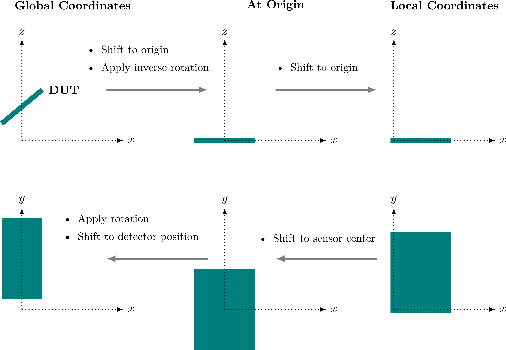

Simulations are frequently performed for a set of different detectors (such as a beam telescope and a device under test). All
of these individual detectors together form what Allpix Squared defines as the geometry. Each detector has a set of
properties attached to it:

-   A unique detector `name` to refer to the detector in the configuration.

-   The `position` in the world frame. This is the position of the geometric center of the sensitive device (sensor) given in
    world coordinates as X, Y and Z s defined in [Section 4.5](./05_geometry_detectors.md#coordinate-systems) (note that any
    additional components like the chip and possible support layers are ignored when determining the geometric center).

-   An `orientation_mode` that determines the way that the orientation is applied. This can be either `xyz`, `zyx` or `zxz`,
    **where `xyz` is used as default if the parameter is not specified**. Three angles are expected as input, which should
    always be provided in the order in which they are applied.

    -   The `xyz` option uses extrinsic Euler angles to apply a rotation around the global X axis, followed by a rotation
        around the global Y axis and finally a rotation around the global Z axis.

    -   The `zyx` option uses the **extrinsic Z-Y-X convention** for Euler angles, also known as Pitch-Roll-Yaw or 321
        convention. The rotation is represented by three angles describing first a rotation of an angle $`\phi`$ (yaw) about
        the Z axis, followed by a rotation of an angle $`\theta`$ (pitch) about the initial Y axis, followed by a third
        rotation of an angle $`\psi`$ (roll) about the initial X axis.

    -   The `zxz` uses the **extrinsic Z-X-Z convention** for Euler angles instead. This option is also known as the 3-1-3 or
        the "x-convention" and the most widely used definition of Euler angles \[[@eulerangles]\].

    {}
    It is highly recommended to always explicitly state the orientation mode instead of relying on the default configuration.
    {}

-   The `orientation` to specify the Euler angles in logical order (e.g. first X, then Y, then Z for the `xyz` method),
    interpreted using the method above (or with the `xyz` method if the `orientation_mode` is not specified). An example for
    three Euler angles would be
    ```ini
    orientation_mode = "zyx"
    orientation = 45deg 10deg 12deg
    ```
    which describes the rotation of 45° around the Z axis, followed by a 10° rotation around the initial Y axis, and finally]
    a rotation of 12° around the initial X axis.

    {}
    All supported rotations are extrinsic active rotations, i.e. the vector itself is rotated, not the coordinate system. All
    angles in configuration files should be specified in the order they will be applied.
    {}

-   A `type` parameter describing the detector model, for example `timepix` or `mimosa26`. These models define the geometry
    and parameters of the detector. Multiple detectors can share the same model, several of which are shipped ready-to-use
    with the framework.

-   An `alignment_precision_position` optional parameter to specify the alignment precision along the three global axes as
    described in [Section 3.3](../03_getting_started/03_detector_configuration.md).

-   An optional parameter `alignment_precision_orientation` for the alignment precision in the three rotation angles as
    described in [Section 3.3](../03_getting_started/03_detector_configuration.md).

-   An optional **electric or magnetic field** in the sensitive device. These fields can be added to a detector by special
    modules as demonstrated in [Section 3.7](../03_getting_started/07_extending_simulation_chain.md#electric-fields).

The detector configuration is provided in the detector configuration file as explained in
[Section 3.3](../03_getting_started/03_detector_configuration.md).

## Coordinate systems

Local coordinate systems for each detector and a global frame ofreference for the full setup are defined. The global
coordinate system is chosen as a right-handed Cartesian system, and the rotations of individual devices are performed around
the geometrical center of their sensor.

Local coordinate systems for the detectors are also right-handed Cartesian systems, with the x- and y-axes defining the
sensor plane. The origin of this coordinate system is the center of the lower left pixel in the grid, i.e. the pixel with
indices (0,0). This simplifies calculations in the local coordinate system as all positions can either be stated in absolute
numbers or in fractions of the pixel pitch.

A sketch of the actual coordinate transformations performed, including the order of transformations, is given below. The
global coordinate system used for tracking of particles through detetector setup is shown on the left side, while the local
coordinate system used to describe the individual sensors is located at the right.

\
*Coordinate transformations from global to local and revers. The first row shows the detector positions in the respective
coordinate systems in top view, the second row in side view.*

The global reference for time measurements is the beginning of the event, i.e. the start of the particle tracking through the
setup. The local time reference is the time of entry of the *first* primary particle of the event into the sensor. This means
that secondary particles created within the sensor inherit the local time reference from their parent particles in order to
have a uniform time reference in the sensor. It should be noted that Monte Carlo particles that start the local time frame on
different detectors do not necessarily have to belong to the same particle track.

## Changing and accessing the geometry

The geometry is needed at a very early stage because it determines the number of detector module instantiations as explained
in [Section 4.4](./04_modules.md#module-instantiation). The procedure of finding and loading the appropriate detector models
is explained in more detail in the [next section](#detector-models).

The geometry is directly added from the detector configuration file described in
[Section 3.3](../03_getting_started/03_detector_configuration.md). The geometry manager parses this file on construction, and
the detector models are loaded and linked later during geometry closing as described above. It is also possible to add
additional models and detectors directly using `addModel` and `addDetector` (before the geometry is closed). Furthermore it
is possible to add additional points which should be part of the world geometry using `addPoint`. This can for example be
used to add the beam source to the world geometry.

The detectors and models can be accessed by name and type through the geometry manager using `getDetector` and `getModel`,
respectively. All detectors can be fetched at once using the `getDetectors` method. If the module is a detector-specific
module its related detector can be accessed through the `getDetector` method of the module base class instead (returns a null
pointer for unique modules) as follows:

```cpp
void run(Event* event) {
    // Returns the linked detector
    std::shared_ptr<Detector> detector = this->getDetector();
}
```

## Detector models

Different types of detector models are available and distributed together with the framework: these models use the
configuration format introduced in [Section 4.3](./03_configuration.md#file-format) and can be found in the `models`
directory of the repository. Every model extends from the `DetectorModel` base class, which defines the minimum required
parameters of a detector model within the framework. The coordinates place the detector in the global coordinate system, with
the reference point taken as the geometric center of the active matrix. This is defined by the number of pixels in the sensor
in both the x- and y-direction, and together with the pitch of the individual pixels the total size of the pixel matrix is
determined. Outside the active matrix, the sensor can feature excess material in all directions in the x-y-plane. A detector
of base class type does not feature a separate readout chip, thus only the thickness of an additional, inactive silicon layer
can be specified. Derived models allow for separate readout chips, optionally connected with bump bonds.

The base detector model can be extended to provide more detailed geometries. Currently implemented derived models are the
`MonolithicPixelDetectorModel`, which describes a monolithic detector with all electronics directly implemented in the same
wafer as the sensor, and the `HybridPixelDetectorModel`, which in addition to the features described above also includes a
separate readout chip with configurable size and bump bonds between the sensor and readout chip.

### Detector model parameters

Models are defined in configuration files which are used to instantiate the actual model classes; these files contain various
types of parameters, some of which are required for all models while others are optional or only supported by certain model
types. For more details on how to add and use a new detector model, [Section 9.5](../09_development/05_new_detector_model.md)
should be consulted.

The set of base parameters supported by every model is provided below. These parameters should be given at the top of the
file before the start of any sub-sections.

-   `type`:
    A required parameter describing the type of the model. At the moment either `monolithic` or `hybrid`. This value
    determines the supported parameters as discussed later.

-   `number_of_pixels`:
    The number of pixels in the 2D pixel matrix. Determines the base size of the sensor together with the `pixel_size`
    parameter below.

-   `pixel_size`:
    The pitch of a single pixel in the pixel matrix. Provided as 2D parameter in the x-y-plane. This parameter is required
    for all models.

-   `implant_size`:
    The size of the collection diode implant in each pixel of the matrix. Provided as 2D parameter in the x-y-plane. This
    parameter is optional, the implant size defaults to the pixel pitch if not specified otherwise.

-   `sensor_material`:
    Semiconductor material of the sensor. This can be any of the sensor materials supported by Allpix Squared, currently
    `SILICON`, `GALLIUM_ARSENIDE`, `GERMANIUM`, `CADMIUM_TELLURIDE`, `CADMIUM_ZINC_TELLURIDE`, `DIAMOND` and
    `SILICON_CARBIDE`. Defaults to `SILICON` if not specified.

-   `sensor_thickness`:
    Thickness of the active area of the detector model containing the individual pixels. This parameter is required for all
    models.

-   `sensor_excess_<direction>`:
    With `<direction>` either `top`, `bottom`, `right` or `left`, where the `top`, `bottom`, `right` and `left` direction are
    the positive y-axis, the negative y-axis, the positive x-axis and the negative x-axis, respectively. Specifies the extra
    material added to the sensor outside the active pixel matrix in the given direction.

-   `sensor_excess`:
    Fallback for the excess width of the sensor in all four directions (top, bottom, right and left). Used if the specialized
    parameters described below are not given. Defaults to zero, thus having a sensor size equal to the number of pixels times
    the pixel pitch.

-   `chip_thickness`:
    Thickness of the readout chip, placed next to the sensor.

The base parameters described above are the only set of parameters supported by the **monolithic** model. For this model, the
`chip_thickness` parameter represents the first few micrometers of sensor material which contain the chip circuitry and are
shielded from the bias voltage and thus do not contribute to the signal formation.

The **hybrid** model adds bump bonds between the chip and sensor while automatically making sure the chip and support layers
are shifted appropriately. Furthermore, it allows the user to specify the chip dimensions independently from the sensor size,
as the readout chip is treated as a separate entity. The additional parameters for the **hybrid** model are as follows:

-   `chip_excess_<direction>`:
    With direction either `top`, `bottom`, `right` or `left`. The chip excess in the specific direction, similar to the
    `sensor_excess_<direction>` parameter described above.

-   `chip_excess`:
    Fallback for the excess width of the chip, defaults to zero and thus to a chip size equal to the dimensions of the pixel
    matrix. See the `sensor_excess` parameter above.

-   `bump_height`:
    Height of the bump bonds (the separation distance between the chip and the sensor).

-   `bump_sphere_radius`:
    The individual bump bonds are simulated as union solids of a sphere and a cylinder. This parameter sets the radius of the
    sphere to use.

-   `bump_cylinder_radius`:
    The radius of the cylinder part of the bump. The height of the cylinder is determined by `bump_height` the parameter.

-   `bump_offset`:
    A 2D offset of the grid of bumps. The individual bumps are by default positioned at the center of each single pixel in
    the grid.

### Support Layers

In addition to the active layer, multiple layers of support material can be added to the detector description. It is possible
to place support layers at arbitrary positions relative to the sensor, while the default position is behind the readout chip
or inactive sensor layer. The defined support materials will always be positioned relative to the corresponding detector. The
support material can be chosen either from a set of predefined materials, including PCB and Kapton, or any material available
via the Geant4 material database.

Every support layer should be defined in its own section headed with the name `[support]`. By default, no support layers are
added. Support layers allow for the following parameters.

-   `size`:
    Size of the support in 2D (the thickness is given separately below). This parameter is required for all support layers.

-   `thickness`:
    Thickness of the support layers. This parameter is required for all support layers.

-   `location`:
    Location of the support layer. Either `sensor` to attach it to the sensor (opposite to the readout chip/inactive sensor
    layer), `chip` to add the support layer behind the chip/inactive layer or `absolute` to specify the offset in the
    z-direction manually. Defaults to `chip` if not specified. If the parameter is equal to `sensor` or `chip`, the support
    layers are stacked in the respective direction when multiple layers of support are specified.

-   `offset`:
    If the `location` parameter is equal to `sensor` or `chip`, an optional 2D offset can be specified using this parameter,
    the offset in the z-direction is then automatically determined. These support layers are by default centered around the
    middle of the pixel matrix (the rotation center of the model). If the `location` is set to `absolute`, the offset is a
    required parameter and should be provided as a 3D vector with respect to the center of the model (thus the center of the
    active sensor). Care should be taken to ensure that these support layers and the rest of the model do not overlap.

-   `hole_size`:
    Adds an optional cut-out hole to the support with the 2D size provided. The hole always cuts through the full support
    thickness. No hole will be added if this parameter is not present.

-   `hole_type`:
    Type of hole to be punched into the support layer. Currently supported are `rectangle` and `cylinder`. Defaults to
    `rectangle`.

-   `hole_offset`:
    If present, the hole is by default placed at the center of the support layer. A 2D offset with respect to its default
    position can be specified using this parameter.

-   `material`:
    Material of the support. Allpix Squared does not provide a set of materials to choose from; it is up to the modules using
    this parameter to implement the materials such that they can use it. [Chapter 7](../07_modules/_index.md) provides
    details about the materials supported by the geometry builder modules (for example in the
    [`GeometryBuilderGeant4 module documenation`](../07_modules/geometrybuildergeant4.md)).

### Accessing specific detector models within the framework

Some modules are written to act on only a particular type of detector model. In order to ensure that a specific detector
model has been used, the model should be downcast: the downcast returns a null pointer if the class is not of the appropriate
type. An example for fetching a `HybridPixelDetectorModel` would thus be:

```cpp
// "detector" is a pointer to a Detector object
auto model = detector->getModel();
auto hybrid_model = std::dynamic_pointer_cast<HybridPixelDetectorModel>(model);
if(hybrid_model != nullptr) {
    // The model of this Detector is a HybridPixelDetectorModel
}
```

### Specializing detector models

A detector model contains default values for all parameters. Some parameters like the sensor thickness can however vary
between different detectors of the same model. To allow for easy adjustment of these parameters, models can be specialized in
the detector configuration file introduced in [Section 3.3](../03_getting_started/03_detector_configuration.md). All model
parameters, except the type parameter and the support layers, can be changed by adding a parameter with the exact same key
and the updated value to the detector configuration. The framework will then automatically create a copy of this model with
the requested change.

{}
Before re-implementing models, it should be checked if the desired change can be achieved using the detector model
specialization. For most cases this provides a quick and flexible way to adapt detectors to different needs and setups (for
example, detectors with different sensor thicknesses).
{}

### Search order for models

To support different detector models and storage locations, the framework searches different paths for model files in the
following order:

1.  If defined, the paths provided in the global `model_paths` parameter are searched first. Files are read and parsed
    directly. If the path is a directory, all files in the directory are added (without recursing into subdirectories).

2.  The location where the models are installed to (refer to the description of the `MODEL_DIRECTORY` variable in
    [Section 2.5](../02_installation/05_cmake_configuration.md)).

3.  The standard data paths on the system as given by the environmental variable `XDG_ DATA_DIRS` with `Allpix/models`
    appended. The variable defaults to `/usr/local/share/` (thus effectively `/usr/local/share/Allpix/models`) followed by
    `/usr/share/` (effectively `/usr/share/Allpix/models`).

4.  The path of the main configuration file.


[@eulerangles]: https://mathworld.wolfram.com/EulerAngles.html
