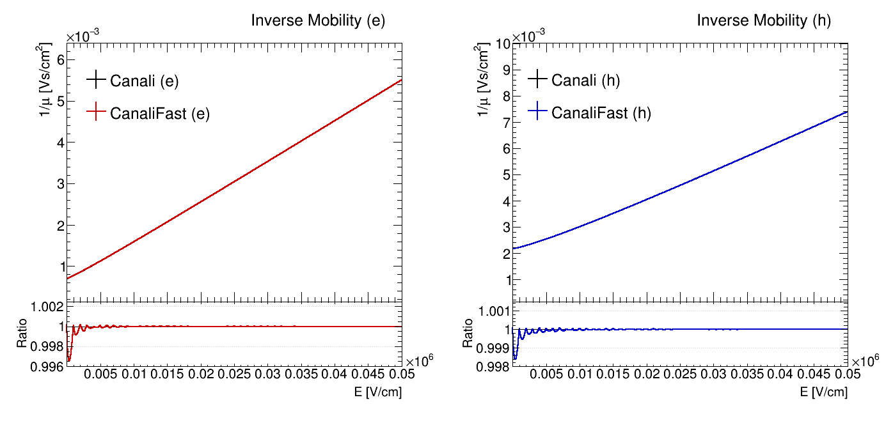
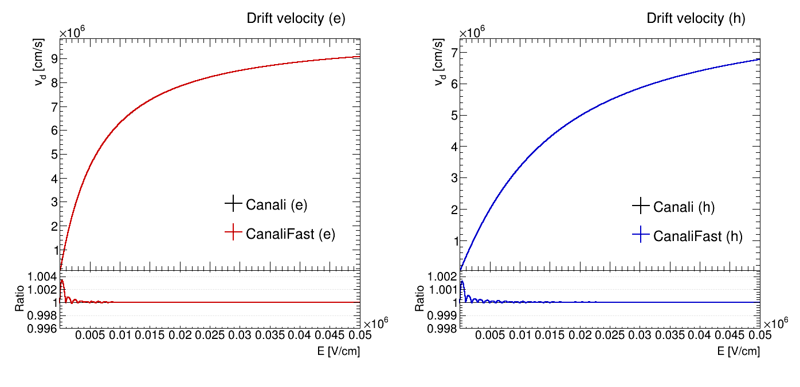

Allpix Squared provides different charge carrier mobility models, the best-suited model depends on the simulated device and
other simulation parameters. Some models depend on the electric field strength to parametrize the mobility, others on the
doping concentration of the device. The charge carrier mobility models are used by all propagation modules and comprise the
following models:

## Jacoboni-Canali Model

The Jacoboni-Canali model \[[@jacoboni]\] is the most widely used parametrization of charge carrier mobility in Silicon as a
function of the electric field $`E`$. It has originally been derived for $`\left<111\right>`$ silicon lattice orientation,
but is widely used also for the common $`\left<100\right>`$ orientation. The mobility is parametrized as:

```math
\mu(E) = \frac{v_m}{E_c} \frac{1}{\left(1 + (E / E_c)^\beta \right)^{1 / \beta}}
```

where $`v_m`$, $`E_c`$, and $`\beta`$ are phenomenological parameters, defined for electrons and holes respectively. The
temperature dependence of these parameters is taken into account by scaling them with respect to a reference parameter value

```math
A = A_{ref} \cdot T^{\gamma}
```

where $`A_{ref}`$ is the reference parameter value, $`T`$ the temperature in units of Kelvin, and $`\gamma`$ the temperature
scaling factor.

The parameter values implemented in Allpix Squared are taken from Table 5 of \[[@jacoboni]\] as

```math
\begin{aligned}
v_{m,e} &= 1.53\times 10^9 \,\text{cm}\,\text{s}^{-1} \cdot T^{-0.87} \\
E_{c,e} &= 1.01 \,\text{V}\,\text{cm}^{-1} \cdot T^{1.55} \\
\beta_e &= 2.57\times 10^{-2} \cdot T^{0.66} \\
\\
v_{m,h} &= 1.62\times 10^8 \,\text{cm}\,\text{s}^{-1} \cdot T^{-0.52} \\
E_{c,h} &= 1.24 \,\text{V}\,\text{cm}^{-1} \cdot T^{1.68} \\
\beta_h &= 0.46 \cdot T^{0.17}
\end{aligned}
```

for electrons and holes, respectively.

This model can be selected in the configuration file via the parameter `mobility_model = "jacoboni"`.

## Canali Model

The Canali model \[[@canali]\] differs from the [Jacoboni-Canali model](#jacoboni-canali-model) in the equation only by the
value of $`v_m`$ for electrons. The difference is most likely a typo in the Jacoboni reproduction of the parametrization, so
this one can be considered the original parametrization derived from data. The altered value is taken from equation 2a in
\[[@canali]\] and amounts to

```math
v_{m,e} = 1.43\times 10^9 \,\text{cm}\,\text{s}^{-1} \cdot T^{-0.87} .
```

A comparison with other models exhibits a better accordance of the electron mobility compared to the Jacoboni-Canali
parameter value, especially at very high values of the electric field.


This model can be selected in the configuration file via the parameter `mobility_model = "canali"`.

## CanaliFast Model

The CanaliFast model is an alternative implementation of the Canali model described above. Instead of calculating the powers
$`x^\beta`$ and $`y^{1 / \beta}`$ directly for every requested mobility value, it uses pre-calculated lookup tables with
fixed binning and interpolates between the nearest bins. Depending on the simulation settings, this can provide a speed-up
of more than 30%.

The boundary values and the binning are chosen according to the expected range of the base. For the Canali model, values from
zero up to a field strength of 1000kV/cm are tabulated in 1000 bins. Separate lookup tables are built for the two power
calculations for electrons and holes, respectively.

For the calculation of $`x^\beta`$, the lower boundary is set to 0 since the electric field strength is positive. The upper
boundary is set to the argument of the Canali model formula, i.e. the maximum field strength divided by the
critical field strength provided by the model.

For the calculation of $`y^{1 / \beta}`$, the lower boundary is set to 1 owing to the offset present in the Canali formula.
The upper boundary is again set to the formula argument, i.e. $`1 + (E / E_C)^\beta`$ with $`E`$ being the maximum tabulated
field strength.

For field strengths outside the range, the first and last bin are extrapolated linearly, respectively.

The following plots show a comparison of the mobility and velocity of electrons and holes as calculated from the Canali and
the CanaliFast models. The maximum relative difference occurs at very low electric field strengths and is less than 0.004.

\
*Comparison of the electron and hole mobilities calculated using the Canali and CanaliFast models as a function of the
electric field strength.*

\
*Comparison of the electron and hole velocities calculated using the Canali and CanaliFast models as a function of the
electric field strength.*

## Hamburg Model

The Hamburg model \[[@hamburg]\] presents an empirical parametrization of electron and hole mobility as a function of the
electric field $`E`$ based on measurements of drift velocities in high-ohmic silicon with $`\left<100\right>`$ lattice
orientation. The mobility is parametrized as

```math
\begin{aligned}
\mu_e^{-1}(E) &= 1 / \mu_{0,e} + E / v_{sat} \\
\\
\mu_h^{-1}(E) &= 1 / \mu_{0,h}                                           &\quad \text{for} \quad E < E_0 \\
              &= 1 / \mu_{0,h} + b \cdot (E - E_0) + c \cdot (E - E_0)^2 &\quad \text{for} \quad E \geq E_0
\end{aligned}
```

as taken from equations 3 and 5 of \[[@hamburg]\].

The temperature dependence of the model parameters are calculated with respect to their reference values at a temperature of
300 Kelvin via equation 6 of \[[@hamburg]\] as:


```math
A_i = A_i(T = 300 \,\text{K}) \cdot \left(\frac{T}{300 \,\text{K}}\right)^{\gamma_i}
```

The hole mobility parameter $`c`$ is assumed to have no temperature dependence.

The parameter values implemented in Allpix Squared are taken from Table 4 of \[[@hamburg]\] as

```math
\begin{aligned}
\mu_{0,e} &= 1530 \,\text{cm}^2\,\text{V}^{-1}\,\text{s}^{-1} \cdot \left(T\ /\ 300 \,\text{K}\right)^{-2.42} \\
v_{sat}   &= 1.03\times 10^7 \,\text{cm}\,\text{s}^{-1} \cdot \left(T\ /\ 300 \,\text{K}\right)^{-0.226} \\
\\
\mu_{0,h} &= 464 \,\text{cm}^2\,\text{V}^{-1}\,\text{s}^{-1} \cdot \left(T\ /\ 300 \,\text{K}\right)^{-2.20} \\
b         &= 9.57\times 10^{-8} \,\text{cm}\,\text{s}^{-1} \cdot \left(T\ /\ 300 \,\text{K}\right)^{-0.101} \\
c         &= -3.31\times 10^{-13} \,\text{s}\,\text{V}^{-1} \\
E_0       &= 2640 \,\text{V}\,\text{cm}^{-1} \cdot \left(T\ /\ 300 \,\text{K}\right)^{0.526}
\end{aligned}
```

for electrons and holes, respectively.

This model can be selected in the configuration file via the parameter `mobility_model = "hamburg"`.

## Hamburg High-Field Model

The Hamburg high-field model \[[@hamburg]\] takes the same form as the [Hamburg model](#hamburg-model), but uses a different
set of parameter values. The values are taken from Table 3 of \[[@hamburg]\] and are suitable for electric field strengths
above $`2.5 \,\text{kV}\,\text{cm}^{-1}`$. Again, no temperature dependence is assumed on hole mobility parameter $`c`$,
while all other parameters are scaled to temperatures different than 300 Kelvin using the equation from the
[Hamburg model](#hamburg-model).

The parameter values implemented in Allpix Squared are

```math
\begin{aligned}
\mu_{0,e} &= 1430 \,\text{cm}^2\,\text{V}^{-1}\,\text{s}^{-1} \cdot \left(T\ /\ 300 \,\text{K}\right)^{-1.99} \\
v_{sat}   &= 1.05\times 10^7 \,\text{cm}\,\text{s}^{-1} \cdot \left(T\ /\ 300 \,\text{K}\right)^{-0.302} \\
\\
\mu_{0,h} &= 457 \,\text{cm}^2\,\text{V}^{-1}\,\text{s}^{-1} \cdot \left(T\ /\ 300 \,\text{K}\right)^{-2.80} \\
b         &= 9.57\times 10^{-8} \,\text{cm}\,\text{s}^{-1} \cdot \left(T\ /\ 300 \,\text{K}\right)^{-0.155} \\
c         &= -3.24\times 10^{-13} \,\text{s}\,\text{V}^{-1} \\
E_0       &= 2970 \,\text{V}\,\text{cm}^{-1} \cdot \left(T\ /\ 300 \,\text{K}\right)^{0.563}
\end{aligned}
```

for electrons and holes, respectively.

This model can be selected in the configuration file via the parameter `mobility_model = "hamburg_highfield"`.

## Masetti Model

The Masetti mobility model \[[@masetti]\] parametrizes electron and hole mobility as a function of the total doping
concentration $`D`$ of the silicon material. This model requires a doping profile to be loaded for the detector in question,
and an error will be returned if the doping profile is missing.

While this mobility model requires the *total doping concentration* $`N_D + N_A`$ as parameter, the doping profile used
throughout Allpix Squared provides the *effective doping concentration* $`N_D - N_A`$ since this also encodes the majority
charge carriers via its sign. However, in the parts of a silicon detector relevant for this simulation, i.e. the sensing
volume, the difference between effective and total concentration is expected to be negligible. Therefore the doping
concentration in this model is taken as the absolute value $`N = \left|N_D - N_A\right|`$.

The mobility is parametrized as

```math
\begin{aligned}
\mu_e(N) &= \mu_{0,e} + \frac{\mu_{max,e} - \mu_{0,e}}{1 + (N / C_{r,e})^{\alpha_e}} - \frac{\mu_{1,e}}{1 + (C_{s,e} / N)^{\beta_e}} \\
\mu_h(N) &= \mu_{0,h} \cdot e^{-P_c / N} + \frac{\mu_{max,h}}{1 + (N / C_{r,h})^{\alpha_h}} - \frac{\mu_{1,h}}{1 + (C_{s,h} / N)^{\beta_h}}
\end{aligned}
```

as taken from equations 1 (for electrons) and 4 (for holes) of \[[@masetti]\].

Only the parameters $`\mu_{max}`$ for both electrons and holes are temperature dependent and are scaled according to the
equation from the [Hamburg model](#hamburg-model) with parameters $`\gamma_e = -2.5`$ for electrons and $`\gamma_e = -2.2`$
for holes.

The parameter values implemented in Allpix Squared are taken from Table I of \[[@masetti]\] for phosphorus and boron as

```math
\begin{aligned}
\mu_{0,e}   &= 68.5 \,\text{cm}^2\,\text{V}^{-1}\,\text{s}^{-1} \\
\mu_{max,e} &= 1414 \,\text{cm}^2\,\text{V}^{-1}\,\text{s}^{-1} \cdot \left(T\ /\ 300 \,\text{K}\right)^{-2.5} \\
C_{r,e}     &= 9.20\times 10^{16} \,\text{cm}^{-3} \\
\alpha_{e}  &= 0.711 \\
\mu_{1,e}   &= 56.1 \,\text{cm}^2\,\text{V}^{-1}\,\text{s}^{-1} \\
C_{s,e}     &= 3.41\times 10^{20} \,\text{cm}^{-3} \\
\beta_{e}   &= 1.98 \\
\\
\mu_{0,h}   &= 44.9 \,\text{cm}^2\,\text{V}^{-1}\,\text{s}^{-1} \\
\mu_{max,h} &= 470.5 \,\text{cm}^2\,\text{V}^{-1}\,\text{s}^{-1} \cdot \left(T\ /\ 300 \,\text{K}\right)^{-2.2} \\
C_{r,h}     &= 2.23\times 10^{17} \,\text{cm}^{-3} \\
\alpha_{h}  &= 0.719 \\
\mu_{1,h}   &= 29.0 \,\text{cm}^2\,\text{V}^{-1}\,\text{s}^{-1} \\
C_{s,h}     &= 6.1\times 10^{20} \,\text{cm}^{-3} \\
\beta_{h}   &= 2.0 \\
P_{c}       &= 9.23\times 10^{16} \,\text{cm}^{-3}
\end{aligned}
```

for electrons and holes, respectively.

This model can be selected in the configuration file via the parameter `mobility_model = "masetti"`.

## Arora Model

The Arora mobility model \[[@arora]\] parametrizes electron and hole mobility as a function of the total doping concentration
of the silicon material. This model requires a doping profile to be loaded for the detector in question, and an error will be
returned if the doping profile is missing. The same caveat to doping concentration information in Allpix Squared applies as
described in the previous section.

The mobility is parametrized as

```math
\begin{aligned}
\mu_e(N) &= \mu_{min,e} + \mu_{0,e} / \left(1 + (N / N_{ref,e})^{\alpha}\right) \\
\mu_h(N) &= \mu_{min,h} + \mu_{0,h} / \left(1 + (N / N_{ref,h})^{\alpha}\right)
\end{aligned}
```

as taken from equations 8 (for electrons) and 13 (for holes) of \[[@arora]\].

The parameter values are provided at the reference temperature of 300 Kelvin and scaled to different temperatures according
to the equation from the [Hamburg model](#hamburg-model). The values implemented in Allpix Squared are taken from Table 1 and
the formulas of \[[@arora]\] as

```math
\begin{aligned}
\mu_{min,e} &= 88.0 \,\text{cm}^2\,\text{V}^{-1}\,\text{s}^{-1} \cdot \left(T\ /\ 300 \,\text{K}\right)^{-0.57} \\
\mu_{0,e}   &= 7.40\times 10^8 \,\text{cm}^2\,\text{V}^{-1}\,\text{s}^{-1} \cdot T^{-2.33} \\
N_{ref,e}   &= 1.26\times 10^{17} \,\text{cm}^{-3} \cdot \left(T\ /\ 300 \,\text{K}\right)^{2.4} \\
\\
\mu_{min,h} &= 54.3 \,\text{cm}^2\,\text{V}^{-1}\,\text{s}^{-1} \cdot \left(T\ /\ 300 \,\text{K}\right)^{-0.57} \\
\mu_{0,h}   &= 1.36\times 10^8 \,\text{cm}^2\,\text{V}^{-1}\,\text{s}^{-1} \cdot T^{-2.23} \\
N_{ref,h}   &= 2.35\times 10^{17} \,\text{cm}^{-3} \cdot \left(T\ /\ 300 \,\text{K}\right)^{2.4} \\
\alpha      &= 0.88 \cdot \left(T\ /\ 300 \,\text{K}\right)^{-0.146}
\end{aligned}
```

for electrons and holes, respectively.

This model can be selected in the configuration file via the parameter `mobility_model = "arora"`.

## Extended Canali Model

This model extends the [Jacoboni-Canali model](#jacoboni-canali-model) described with other doping concentration dependent,
low-field models such as the [Masetti model](#masetti-model). This technique is for example used in the Synopsys Sentaurus
TCAD software.

The mobility is then parametrized using the two models as

```math
\mu(E, N) = \frac{\mu_{m}(N)}{\left(1 + \left(\mu_{m}(N) \cdot E / v_{m} \right)^{\beta} \right)^{1 / \beta}} ,
```

where $`\mu_{m}(N)`$ is the mobility from the [Masetti model](#masetti-model) and $`v_m`$, $`\beta`$ are the respective
parameters from the [Canali model](#jacoboni-canali-model).

This model can be selected in the configuration file via the parameter `mobility_model = "masetti_canali"`.

## Ruch-Kino Model

The Ruch-Kino mobility model \[[@ruchkino]\] parametrizes electron and hole mobility in GaAs sensor material. The model
parameters implemented in Allpix Squared is taken from measurements \[[@Bergmann_2020]\].

The mobility is parametrized as

```math
\begin{aligned}
\mu_e(E) &= \mu_{0,e}                                             &\quad \text{for} \quad E < E_0 \\
         &= \mu_{0,e} / \sqrt{1 + \left(E - E_0\right)^2 / E_c^2} &\quad \text{for} \quad E \geq E_0 \\
\\
\mu_h(E) &= \mu_{0,h} .
\end{aligned}
```

The values implemented in Allpix Squared are:

```math
\begin{aligned}
E_0        &= 3.1\times 10^3 \,\text{V}\,\text{cm}^{-1} \\
E_c        &= 1.36\times 10^3 \,\text{V}\,\text{cm}^{-1} \\
\mu\_{0,e} &= 7.6\times 10^3 \,\text{cm}^2\,\text{V}^{-1}\,\text{s}^{-1} \\
\mu\_{0,h} &= 3.2\times 10^2 \,\text{cm}^2\,\text{V}^{-1}\,\text{s}^{-1}
\end{aligned}
```

This model can be selected in the configuration file via the parameter `mobility_model = "ruch_kino"`.

## Quay Model

The Quay mobility model describes the mobility of electron and holes in a large range of semiconductor materials. In the
original publication \[[@quay]\], the saturation velocity is modeled via the relation

```math
v_{sat}\left(T\right) = \frac{v_{sat,300}}{(1-A) + A \cdot \left(T / 300 \,K\right)} ,
```

with the saturation velocity at 300 Kelvin and the free parameter $`A`$.

In Allpix Squared the mobility is determined according to a model published in \[[@omar]\], as a function of the saturation
velocity $`v_{sat}`$, the electrical field $`E`$ and the critical field $`E_C`$:

```math
\mu_e\left(E\right) = \frac{v_{sat}}{E_C \cdot \sqrt{ 1 + \left( E/E_C \right)^2 }} .
```

The critical field in turn is defined as the saturation velocity divided by the mobility at zero field, where the zero-field
mobility scales with temperature according to \[[@omar]\]:

```math
E_C(T) = \frac{v_{sat}}{M\ T^{-\gamma}} .
```

The model has been implemented for silicon, germanium and gallium arsenide. Parameters for several other compound
semiconductors are given in \[[@quay]\] and \[[@LandoltBornstein]\]. The parameters implemented in Allpix Squared and their
references are listed in the table below.

| Material         | Parameter                                                           | Electrons           | Holes               | References                       |
|:-----------------|:--------------------------------------------------------------------|:--------------------|:--------------------|:---------------------------------|
| Silicon          | $`v_{sat,300}\ [\text{cm}\,\text{s}^{-1}]`$                         | $`1.02\times 10^7`$ | $`0.72\times 10^7`$ | \[[@quay]\]                      |
|                  | $`A`$                                                               | $`0.74`$            | $`0.37`$            | \[[@quay]\]                      |
|                  | $`M\ [\text{cm}^2\,\text{K}^\gamma\,\text{V}^{-1}\,\text{s}^{-1}]`$ | $`1.43\times 10^9`$ | $`1.35\times 10^8`$ | \[[@jacoboni]\]                  |
|                  | $`\gamma`$                                                          | $`2.42`$            | $`2.2`$             | \[[@jacoboni]\]                  |
| Germanium        | $`v_{sat,300}\ [\text{cm}\,\text{s}^{-1}]`$                         | $` 0.7\times 10^7`$ | $`0.63\times 10^7`$ | \[[@quay]\]                      |
|                  | $`A`$                                                               | $`0.45`$            | $`0.39`$            | \[[@quay]\]                      |
|                  | $`M\ [\text{cm}^2\,\text{K}^\gamma\,\text{V}^{-1}\,\text{s}^{-1}]`$ | $`5.66\times 10^7`$ | $`1.05\times 10^9`$ | \[[@omar], [@LandoltBornstein]\] |
|                  | $`\gamma`$                                                          | $`1.68`$            | $`2.33`$            | \[[@omar], [@LandoltBornstein]\] |
| Gallium Arsenide | $`v_{sat,300}\ [\text{cm}\,\text{s}^{-1}]`$                         | $`0.72\times 10^7`$ | $` 0.9\times 10^7`$ | \[[@quay]\]                      |
|                  | $`A`$                                                               | $`0.44`$            | $`0.59`$            | \[[@quay]\]                      |
|                  | $`M\ [\text{cm}^2\,\text{K}^\gamma\,\text{V}^{-1}\,\text{s}^{-1}]`$ | $` 2.5\times 10^6`$ | $` 6.3\times 10^7`$ | \[[@LandoltBornstein]\]          |
|                  | $`\gamma`$                                                          | $` 1.0`$            | $` 2.1`$            | \[[@LandoltBornstein]\]          |

## Levinshtein Mobility

The Levinshtein mobility model describes the mobility of electron and holes in Gallium Nitride. The publication \[[@Levinshtein]\] models the electron and hole mobilities as a function of doping concentration and temperature. The temperature dependent model follows the relation

```math
\begin{aligned}
\mu_e (T, N) &= \frac{\mu_{max,e}}{\frac{1}{B_e(N) \left(T/T_0\right)^{\beta_e}} + \left(\frac{T}{T_0}\right)^{\alpha_e}} \\
\mu_h (T, N) &= \frac{\mu_{max,h}}{\frac{1}{B_h(N)} + \left(\frac{T}{T_0}\right)^{\alpha_h}} \\
B_{i} (N)    &= \left[ \frac{\mu_{min,i}+\mu_{max,i}\left(\frac{N_{ref,i}}{N}\right)^{\gamma_i}}{\mu_{max,i}-\mu_{min,i}} \right]\bigg\rvert_{T=T_0}
\end{aligned}
```

as taken from equations 6 and 7. The following parameters in use are taken from tables 1 and 2 in the reference publication:

```math
\begin{aligned}
\mu\_{max,e} &= 1000 \,\text{cm}^2\,\text{V}^{-1}\,\text{s}^{-1} \\
\mu\_{min,e} &= 55 \,\text{cm}^2\,\text{V}^{-1}\,\text{s}^{-1} \\
N_{ref,e}    &= 2 \times 10^17 \\
\alpha_e     &= 2.0 \\
\beta_e      &= 0.7 \\
\gamma_e     &= 1.0 \\
\mu\_{max,h} &= 170 \,\text{cm}^2\,\text{V}^{-1}\,\text{s}^{-1} \\
\mu\_{min,h} &= 3 \,\text{cm}^2\,\text{V}^{-1}\,\text{s}^{-1} \\
N_{ref,h}    &= 3 \times 10^17 \\
\alpha_h     &= 5.0 \\
\gamma_h     &= 2.0
\end{aligned}
```

This model can be selected in the configuration file via the parameter `mobility_model = "levinshtein"`.

## Constant Mobility

Some simulations require constant charge carrier mobility values $`\mu = \text{const}`$. This can be simulated with this
model. For more complex mobility dependencies the custom mobility model described next should be used.

This model can be selected in the configuration file via the parameter `mobility_model = "constant`.

It requires the additional configuration keys `mobility_electron` and `mobility_hole` to be present in the module
configuration section, for example:

```ini
mobility_model = "constant"
mobility_electron = 1000cm*cm/V/s
mobility_hole = 50cm*cm/V/s
```

## Custom Mobility Models

Allpix Squared provides the possibility to use fully custom mobility models. In order to use a custom model, the parameter
`mobility_model = "custom"` needs to be set in the configuration file. Additionally, the following configuration keys have to
be provided:

- `mobility_function_electrons`:
  The formula describing the electron mobility.

- `mobility_function_holes`:
  The formula describing the hole mobility.

The functions defined via these parameters can depend on the local electric field and the local doping concentration. In
order to use the electric field magnitude in the formula, an `x` has to be placed at the respective position, for the doping
concentration a `y` is used as placeholder.

Parameters of the functions can either be placed directly in the formulas in framework-internal units, or provided separately
as arrays via the `mobility_parameters_electrons` and `mobility_parameters_electrons`. Placeholders for parameters in the
formula are denoted with squared brackets and a parameter number, for example `[0]` for the first parameter provided.
Parameters specified separately from the formula can contain units which will be interpreted automatically.

{}
Parameters directly placed in the mobility formula have to be supplied in framework-internal units since the function will be
evaluated with both electric field strength and doping concentration in internal units. It is recommended to use the
possibility of separately configuring the parameters and to make use of units to avoid conversion mistakes.
{}

The following set of parameters re-implements the [Jacoboni-Canali mobility](#jacoboni-canali-model) model using a custom
mobility model. The mobility is calculated at a fixed temperature of 293 Kelvin.

```ini
# Replicating the Jacoboni-Canali mobility model at T = 293K
mobility_model = "custom"

mobility_function_electrons = "[0]/[1]/pow(1.0+pow(x/[1],[2]),1.0/[2])"
mobility_parameters_electrons = 1.0927393e7cm/s, 6729.24V/cm, 1.0916

mobility_function_holes = "[0]/[1]/pow(1.0+pow(x/[1],[2]),1.0/[2])"
mobility_parameters_holes = 8.447804e6cm/s, 17288.57V/cm, 1.2081
```

{}
It should be noted that the temperature passed via the module configuration is not evaluated for the custom mobility model,
but the model parameters need to be manually adjusted to the required temperature.
{}

The interpretation of the custom mobility functions is based on the `ROOT::TFormula` class \[[@rootformula]\] and supports
all corresponding features, mathematical expressions and constants.


[@jacoboni]: https://doi.org/10.1016/0038-1101(77)90054-5
[@canali]: https://doi.org/10.1109/T-ED.1975.18267
[@hamburg]: https://doi.org/10.1016/j.nima.2015.07.057
[@masetti]: https://doi.org/10.1109/T-ED.1983.21207
[@arora]: https://doi.org/10.1109/T-ED.1982.20698
[@ruchkino]: https://doi.org/10.1103/PhysRev.174.921
[@Bergmann_2020]: https://doi.org/10.1088/1748-0221/15/03/c03013
[@quay]: https://doi.org/10.1016/S1369-8001(00)00015-9
[@omar]: https://doi.org/10.1016/0038-1101(87)90063-3
[@LandoltBornstein]: https://doi.org/10.1007/b80447
[@Levinshtein]: https://doi.org/10.1016/S0038-1101(02)00256-3
[@rootformula]: https://root.cern.ch/doc/master/classTFormula.html
